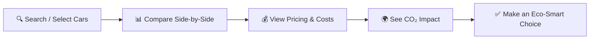

<p align="center">
  
</p>

<h1 align="center">🌿 DriveNeutral</h1>

<p align="center">
  <b>Drive Smarter. Drive Greener.</b><br/>
  A sustainability-focused vehicle comparison platform that helps users compare cars based on fuel cost, efficiency, and carbon emissions.
</p>

<p align="center">
  <a href="https://driveneutral.netlify.app"></a>
  
  
</p>

---

## 📖 About

**DriveNeutral** empowers users to make eco-conscious decisions when choosing their next vehicle. Whether you're eyeing an electric car, a fuel-efficient hybrid, or a traditional petrol/diesel vehicle — DriveNeutral gives you the data to compare them side by side on **cost**, **efficiency**, and **environmental impact**.

---

## ✨ Features

| Feature | Description |
|---|---|
| ⚡ **Vehicle Comparison** | Compare petrol, diesel, hybrid & EV vehicles across specs, pricing, and eco-scores |
| 🌍 **CO₂ Emission Insights** | Visualize real-world carbon footprint and lifecycle emissions per vehicle |
| 💰 **Cost Savings Calculator** | Calculate fuel vs. electricity costs, 5-year ownership savings, and break-even timelines |
| 🔍 **Smart Vehicle Lookup** | Search and explore 80+ Indian car models with detailed specifications |
| 🤖 **AI Chatbot** | Ask questions, get EV recommendations, and compare vehicles via a conversational interface |
| 📊 **Savings & Impact Charts** | Interactive Line, Bar & Donut charts showing long-term savings and CO₂ reduction |
| 🏙️ **City-Specific Pricing** | Ex-showroom & on-road prices with auto-detected location and local RTO/tax rates |
| 🎨 **Premium Dark UI** | Modern glassmorphism design with smooth animations and responsive layout |

---

## 🖥️ Tech Stack

<table>
  <tr>
    <td align="center"><br/><sub>Frontend</sub></td>
    <td align="center"><br/><sub>Build Tool</sub></td>
    <td align="center"><br/><sub>Database</sub></td>
    <td align="center"><br/><sub>Hosting</sub></td>
  </tr>
  <tr>
    <td align="center"><br/><sub>Animations</sub></td>
    <td align="center"><br/><sub>Charts</sub></td>
    <td align="center"><br/><sub>Styling</sub></td>
    <td align="center"><br/><sub>Icons</sub></td>
  </tr>
</table>

---

## 🚀 Getting Started

### Prerequisites

- **Node.js** v18+ and **npm** v9+
- A **Supabase** project with the `Cardetailtable` configured

### Installation

```bash
# 1. Clone the repository
git clone https://github.com/your-username/DriveNeutral.git
cd DriveNeutral

# 2. Install dependencies
npm install

# 3. Set up environment variables
cp .env.example .env
# Edit .env and add your Supabase URL, Anon Key, and Unsplash API key

# 4. Start the development server
npm run dev
```

### Environment Variables

Create a `.env` file in the root directory:

```env
VITE_SUPABASE_URL=your_supabase_project_url
VITE_SUPABASE_ANON_KEY=your_supabase_anon_key
VITE_UNSPLASH_ACCESS_KEY=your_unsplash_key    # optional
```

---

## 📁 Project Structure

```
DriveNeutral/
├── public/                  # Static assets
├── src/
│   ├── components/          # React components
│   │   ├── AIChatflow.jsx       # AI-powered chatbot interface
│   │   ├── CarbonCalculator.jsx # CO₂ footprint calculator
│   │   ├── CarPricing.jsx       # Ex-showroom & on-road pricing
│   │   ├── ComparisonSection.jsx# Side-by-side vehicle comparison
│   │   ├── FindCar.jsx          # Vehicle search & lookup
│   │   ├── HeroSection.jsx      # Landing page hero
│   │   ├── SavingsImpact.jsx    # Savings charts & visualizations
│   │   └── ...
│   ├── context/             # React Context (Auth)
│   ├── services/            # Business logic
│   │   ├── chatflowService.js   # AI chatbot engine
│   │   ├── pricingService.js    # Pricing, formatting, tax rates
│   │   └── locationService.js   # Auto city detection (GPS/IP)
│   ├── App.jsx              # Root component & routing
│   └── main.jsx             # Entry point
├── .env                     # Environment variables
├── vite.config.js           # Vite configuration
└── package.json
```

---

## 🌱 How It Works



1. **Search** — Find cars from 80+ Indian models across all fuel types
2. **Compare** — Place vehicles side-by-side to compare specs, pricing, and eco-scores
3. **Calculate** — See fuel costs, EV savings, break-even timelines, and 5-year ownership costs
4. **Decide** — Make an informed, sustainability-first vehicle purchase decision

---

## 📸 Screenshots

> *Coming soon — screenshots of the Vehicle Comparison, AI Chatbot, Savings Charts, and Carbon Calculator sections.*

---

## 🤝 Contributing

Contributions are welcome! Here's how you can help:

1. **Fork** the repository
2. **Create** a feature branch (`git checkout -b feature/amazing-feature`)
3. **Commit** your changes (`git commit -m 'Add amazing feature'`)
4. **Push** to the branch (`git push origin feature/amazing-feature`)
5. **Open** a Pull Request

---

## 📄 License

This project is licensed under the **MIT License** — see the [LICENSE](LICENSE) file for details.

---

## 🙏 Acknowledgements

- [Supabase](https://supabase.com) — Backend & Database
- [CarWale](https://www.carwale.com) — Car pricing data reference
- [Framer Motion](https://www.framer.com/motion/) — Smooth animations
- [Chart.js](https://www.chartjs.org) — Data visualizations
- [Lucide Icons](https://lucide.dev) — Beautiful icon set

---

<p align="center">
  Made with 💚 for a greener future<br/>
  <b>DriveNeutral</b> — <i>Drive Smarter. Drive Greener.</i>
</p>
